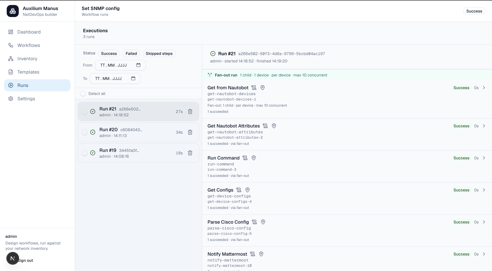
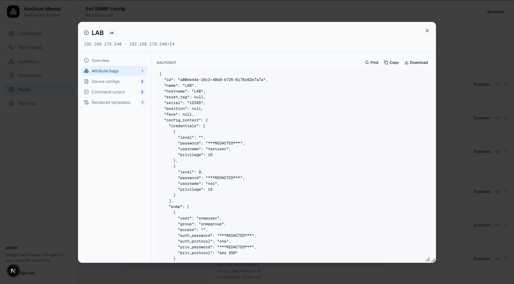
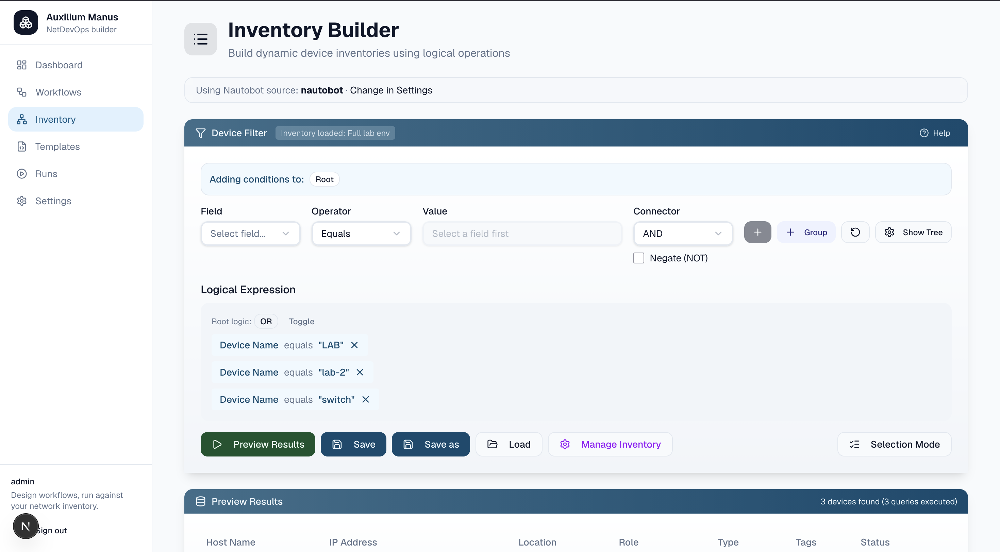
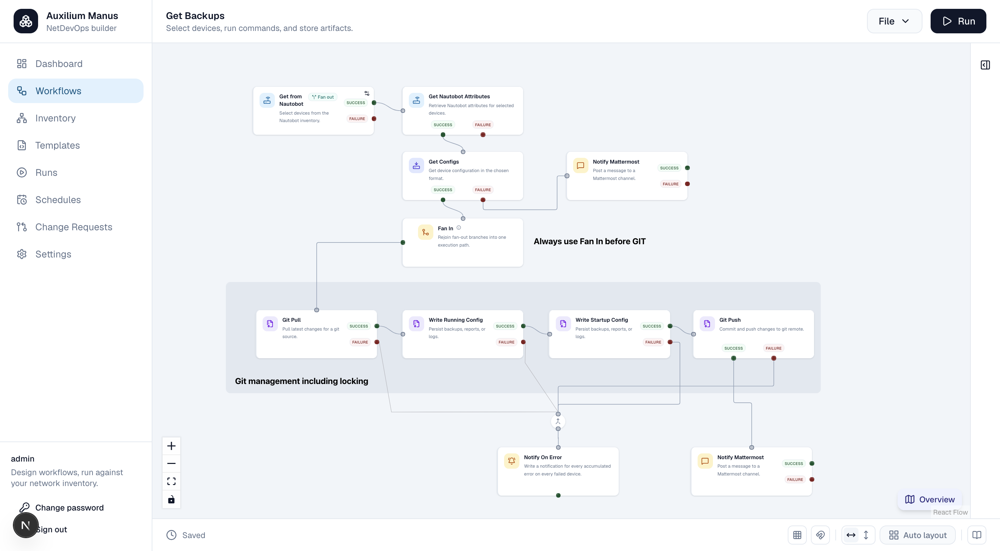
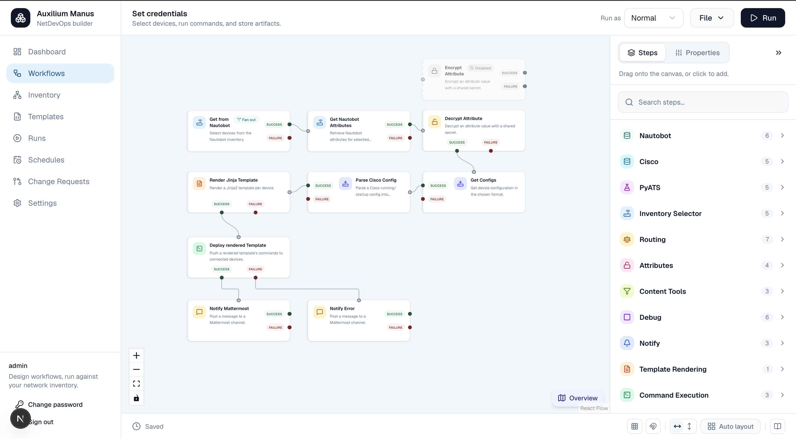
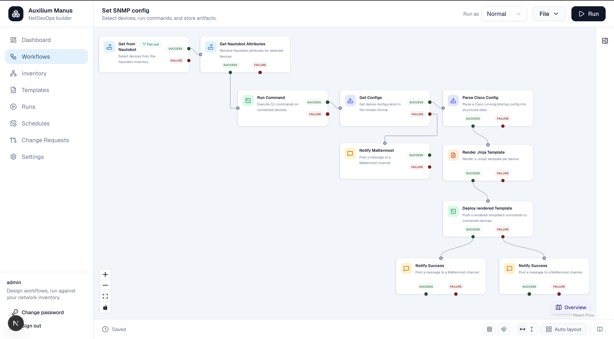

# Auxilium Manus

*Auxilium Manus* — Latin for "helping hand" — is a NetDevOps workflow builder for network
engineers. It lets you design, configure, and execute network automation workflows
visually, without writing a script for every task.

## What it does

Network automation usually means one-off scripts: a Python file that logs into a device,
pulls config, maybe pushes a change, and prints the result. Auxilium Manus replaces that
with a visual, repeatable workflow model:

- **Pick devices from inventory** — pull live device data from Nautobot (or a static
  inventory) and select one or more targets before building a workflow around them.
- **Design workflows on a canvas** — compose steps (get config, run a command, render a
  Jinja template, evaluate a condition, write to Git, update Nautobot/ISE, store an
  artifact, snapshot and diff structured device state via pyATS, …) as nodes on a React
  Flow canvas, connected by dependency-aware edges. The output of one step becomes the
  input of the next.
- **Run once or fan out** — execute a workflow interactively against a single device, or
  fan it out into a parallel per-device child workflow across an entire device group.
- **Get durable, resumable execution** — runs are orchestrated by Hatchet, so long-running
  or multi-device workflows survive worker restarts, support retries, and can be paused at
  a debug step or an approval gate.
- **Keep an audit trail** — every run is stored separately from the workflow definition,
  with per-step status, logs, and results. Command output, device configuration backups,
  and other generated artifacts are persisted as durable, downloadable artifacts.
- **Version-control workflow definitions (optional)** — turn version control on for a
  workflow and every save is also committed and pushed to a configured Git repository, so
  you get commit history, a side-by-side diff between versions, and one-click restore of an
  older version. The database stays the source of truth either way; Git is an additional,
  best-effort mirror, not a replacement for it.
- **Get notified when something goes wrong** — wire a workflow's failure paths to a
  shared error-sink step that posts to a Mattermost channel (and/or the in-app
  Notifications dashboard) with the failing device, step, and error message, instead of
  someone having to go check a run's logs to find out it failed.

Under the hood, a workflow definition is a backend-owned JSON graph (distinct from the
React Flow canvas/UI state), validated and compiled into executable steps by the backend.
Steps that talk to devices use Netmiko over SSH; steps that need structured, parsed
device state (rather than raw CLI text) build a pyATS testbed and use Genie to fetch and
parse config or "learn" live feature state; steps that talk to inventory use the Nautobot
API; results run through role-based access control so only authorized users can view or
trigger specific workflows and settings.

## Key features

- Visual, drag-and-drop workflow canvas (React Flow) with live validation
- Device-first design: select inventory targets, then build the workflow around them
- Nautobot integration for device inventory, attributes, and updates
- Optional Cisco ISE integration (device add, TACACS+ key management)
- Git-backed steps for cloning, pulling, and pushing configuration/templates
- Jinja2 template rendering and config deployment to devices via Netmiko/SSH
- Durable, retryable background execution via Hatchet, with per-run logs and artifacts
- Fan-out execution: run a workflow across every device in a group in parallel
- pyATS/Genie integration: build a testbed, fetch and parse running config, capture a
  "learn" snapshot of live feature state (BGP, OSPF, interfaces, platform, …), and diff a
  snapshot against a stored reference using Genie's structure-aware diff
- Notifications: write in-app notifications and/or post to a Mattermost channel, either
  per-step or from a shared error sink that reports every accumulated failure across a
  run's fanned-out devices
- Optional Git-backed version control for workflow definitions: per-workflow opt-in,
  auto-commit and push on save, commit history with a diff view, and one-click restore
- Credential vault (encrypted at rest, with SSH login/SSH key/token credential types) and
  RBAC-protected settings, users, and workflows

## Tech stack

**Frontend:** Next.js (App Router), React, React Flow, TypeScript, Tailwind CSS, Shadcn
UI, TanStack Query, Zustand, React Hook Form, Zod

**Backend:** FastAPI, Python, PostgreSQL, SQLAlchemy, Redis, JWT auth, Hatchet, Netmiko,
GitPython, pyATS/Genie

**Integrations:** Nautobot API, Cisco ISE, pyATS, Mattermost

## The app

**View the result of a run** — browse run history, see per-step status and duration, and
inspect fan-out runs across multiple devices:

**Look at the result of a device** — drill into a single device to inspect attribute bags,
configs, command output, and rendered templates from that run:

**Build your Nautobot inventory** — filter devices from a Nautobot source with logical
expressions and preview the matching targets before you run a workflow:

## Examples

**Config backup workflow** — selects devices from Nautobot, pulls their running and
startup configuration, and commits the backups to a Git repository (with Mattermost
notifications on failure):

**Set credentials workflow** — selects devices from Nautobot, reads their configuration,
parses Cisco config, renders a Jinja template to set credentials and remove old users,
and deploys the result back to the devices (with Mattermost notifications on success or
failure):

**Set SNMP config workflow** — selects devices from Nautobot, reads their configuration,
parses Cisco config, renders a Jinja template to configure SNMPv3 and remove legacy
SNMPv1 settings, and deploys the result back to the devices (with Mattermost
notifications on success or failure):

## Installation

See [INSTALL.md](INSTALL.md) for prerequisites, first-time setup, and how to run the app
locally or via Docker.

## License

Apache License 2.0 — see [LICENSE](LICENSE).

## About this project

This project was built largely through *vibecoding* — iterative development with AI
assistants rather than hand-written code from scratch. Most of the implementation was done
with [Claude](https://claude.ai) and [Cursor](https://cursor.com), using models such as
Claude Sonnet 5 and Composer. The codebase has also been reviewed and analyzed with Fable
and other models along the way.

You are welcome to use this software for free, but **at your own risk**. The current
version is not yet stable; you may encounter bugs, incomplete behavior, or breaking
changes. New features and fixes will be added from time to time as the project evolves.
