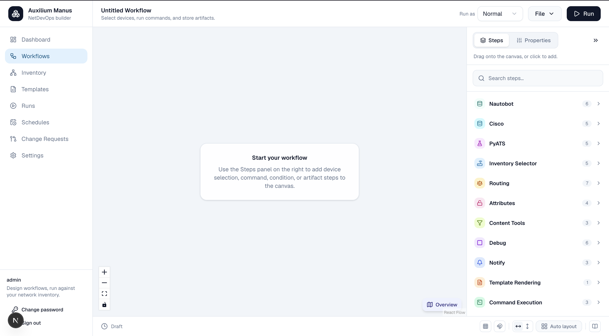

# Auxilium Manus

*Auxilium Manus* — Latin for "helping hand" — is a NetDevOps workflow builder for network
engineers. It lets you design, configure, and execute network automation workflows
visually, without writing a script for every task.

## What it does

Network automation usually means one-off scripts: a Python file that logs into a device,
pulls config, maybe pushes a change, and prints the result. Auxilium Manus replaces that
with a visual, repeatable workflow model:

- **Pick devices from inventory** — pull live device data from Nautobot (or a static
  inventory) and select one or more targets before building a workflow around them.
- **Design workflows on a canvas** — compose steps (get config, run a command, render a
  Jinja template, evaluate a condition, write to Git, update Nautobot/ISE, store an
  artifact, snapshot and diff structured device state via pyATS, analyze routing,
  reachability, and ACLs offline via Batfish, …) as nodes on a React Flow canvas,
  connected by dependency-aware edges. The output of one step becomes the input of the
  next.
- **Run once or fan out** — execute a workflow interactively against a single device, or
  fan it out into a parallel per-device child workflow across an entire device group.
- **Independent branches run in parallel automatically** — if the canvas has two (or
  more) steps with no dependency on each other, the engine runs them concurrently by
  default, no configuration needed. This is a separate axis from fan-out: fan-out
  parallelizes one branch across many devices, this parallelizes different branches
  against the same device/run.
- **Get durable, resumable execution** — runs are orchestrated by Hatchet, so long-running
  or multi-device workflows survive worker restarts, support retries, and can wait at an
  approval gate (Wait & Run) or end early at a Stop Here step for mid-run inspection.
- **Keep an audit trail** — every run is stored separately from the workflow definition,
  with per-step status, logs, and results. Command output, device configuration backups,
  and other generated artifacts are persisted as durable, downloadable artifacts.
- **Version-control workflow definitions (optional)** — turn version control on for a
  workflow and every save is also committed and pushed to a configured Git repository, so
  you get commit history, a side-by-side diff between versions, and one-click restore of an
  older version. The database stays the source of truth either way; Git is an additional,
  best-effort mirror, not a replacement for it.
- **Get notified when something goes wrong** — wire a workflow's failure paths to a
  shared error-sink step that posts to a Mattermost channel (and/or the in-app
  Notifications dashboard) with the failing device, step, and error message, instead of
  someone having to go check a run's logs to find out it failed.
- **Stage changes for review before deploy** — end a workflow with an **Open Change
  Request** step: rendered configs are committed and pushed to a per-change Git branch
  (`manus/cr-{run.id}`), a unified diff is stored, and a **Change Request** row is
  recorded in the local database (`status="staged"`). A reviewer approves it in the
  Change Requests UI (or a signed Git webhook does) and a separate **deploy run**
  continues the pipeline — loading the reviewed files via **From Change Request** and
  applying them to devices. The long review lives as a database row, not a suspended
  workflow, so approval can take arbitrarily long. See
  [doc/CICD_PIPELINE.md](doc/CICD_PIPELINE.md).
- **Collaborate with an AI directly on a workflow** — enable AI Collaboration on an open
  workflow (a time-boxed consent flag, not a shared login) and describe what you want in
  chat; the AI writes steps directly into that same workflow through the real service
  layer, validates the result before you run it, and can draft reusable templates and
  write the workflow's wiki notes along the way. See
  [doc/ai_collaboration/PROCESS.md](doc/ai_collaboration/PROCESS.md).

Under the hood, a workflow definition is a backend-owned JSON graph (distinct from the
React Flow canvas/UI state), validated and compiled into executable steps by the backend.
Steps that talk to devices use Netmiko over SSH; steps that need structured, parsed
device state (rather than raw CLI text) build a pyATS testbed and use Genie to fetch and
parse config or "learn" live feature state; steps that talk to inventory use the Nautobot
API; results run through role-based access control so only authorized users can view or
trigger specific workflows and settings.

## Key features

- Visual, drag-and-drop workflow canvas (React Flow) with live validation
- Device-first design: select inventory targets, then build the workflow around them
- Nautobot integration for device inventory, attributes, and updates
- Optional Cisco ISE integration (device add, TACACS+ key management)
- Git-backed steps for cloning, pulling, and pushing configuration/templates
- Jinja2 template rendering and config deployment to devices via Netmiko/SSH
- Durable, retryable background execution via Hatchet, with per-run logs and artifacts
- Fan-out execution: run a workflow across every device in a group in parallel
- Automatic branch-level concurrency: independent canvas branches (steps with no
  dependency on each other) run in parallel by default — no toggle, no extra config —
  layered on top of, and independent from, per-device fan-out
- pyATS/Genie integration: build a testbed, fetch and parse running config, capture a
  "learn" snapshot of live feature state (BGP, OSPF, interfaces, platform, …), and diff a
  snapshot against a stored reference using Genie's structure-aware diff
- Batfish integration: build an offline network snapshot from collected device configs
  and answer routing, reachability, and ACL questions against it — routing tables, path
  checks, ACL checks, OSPF/BGP facts, node/interface properties, and general config-fact
  extraction/validation — without touching live devices
- Notifications: write in-app notifications and/or post to a Mattermost channel, either
  per-step or from a shared error sink that reports every accumulated failure across a
  run's fanned-out devices
- Optional Git-backed version control for workflow definitions: per-workflow opt-in,
  auto-commit and push on save, commit history with a diff view, and one-click restore
- Staged change requests (CI/CD gate): Open Change Request pushes configs to a Git
  branch and records a Change Request in the local DB; Approve & Deploy (or a signed
  Git webhook) starts a separate deploy run that applies the reviewed change
- Credential vault (encrypted at rest by default, or per-credential in OpenBao when
  enabled) with SSH login/SSH key/token credential types, and RBAC-protected settings,
  users, and workflows
- Secret Manager: generate, rotate, and read operational secrets (TACACS+ keys, SNMP
  community strings/SNMPv3 credentials, …) from a workflow at run time, stored in an
  external OpenBao or Infisical backend chosen per connection
- AI workflow collaboration: a restricted, RBAC-scoped `ai-assistant` identity, per-workflow
  time-boxed consent sessions, four-tier static validation (schema, reference existence,
  capability flow, attribute-path wiring) gating both an explicit Validate action and run
  dispatch itself, near-live canvas sync via polling, and AI-authored templates and wiki notes

## Tech stack

**Frontend:** Next.js (App Router), React, React Flow, TypeScript, Tailwind CSS, Shadcn
UI, TanStack Query, Zustand, React Hook Form, Zod

**Backend:** FastAPI, Python, PostgreSQL, SQLAlchemy, Redis, JWT auth, Hatchet, Netmiko,
GitPython, pyATS/Genie

**Integrations:** Nautobot API, Cisco ISE, pyATS, Batfish, Mattermost, OpenBao/Infisical

## The app

**Workflow editor** — design automation on a visual canvas; drag steps from the panel on
the right to get started:

**View the result of a run** — browse run history, see per-step status and duration, and
inspect fan-out runs across multiple devices:

**Look at the result of a device** — drill into a single device to inspect attribute bags,
configs, command output, and rendered templates from that run:

**Build your Nautobot inventory** — filter devices from a Nautobot source with logical
expressions and preview the matching targets before you run a workflow:

## Examples

**Config backup workflow** — selects devices from Nautobot, pulls their running and
startup configuration, and commits the backups to a Git repository (with Mattermost
notifications on failure):

**Set credentials workflow** — selects devices from Nautobot, reads their configuration,
parses Cisco config, renders a Jinja template to set credentials and remove old users,
and deploys the result back to the devices (with Mattermost notifications on success or
failure):

**Set SNMP config workflow** — selects devices from Nautobot, reads their configuration,
parses Cisco config, renders a Jinja template to configure SNMPv3 and remove legacy
SNMPv1 settings, and deploys the result back to the devices (with Mattermost
notifications on success or failure):

## AI collaboration

Most workflow builders stop at letting an AI assistant suggest a script in a chat
window that you then copy in by hand. Auxilium Manus goes further: an AI collaborator
can write directly into an open workflow, in place, through the same code path the
UI itself uses — a rare capability among NetDevOps tools.

- **A real, audited actor — not a shared login.** The AI acts as its own RBAC-scoped
  user (`ai-assistant`), seeded inactive by default and deliberately permission-limited
  (no `workflows:execute`, no `credentials:reveal`, nothing touching RBAC, users, or
  system settings — it can draft a workflow but structurally cannot run it or grant
  itself more access). You stay logged in as yourself the entire time; every AI-made
  change is attributed to `ai-assistant` in the audit trail and the version-control
  mirror, never blended with your own edits.
- **Consent is a time-boxed flag, not a standing switch.** Turning on "AI
  Collaboration" for a workflow opens a short-lived session (60 minutes by default).
  Writes are refused outside an active session, and enabling it never requires logging
  in as the AI to watch it work.
- **It writes through the real service layer — no second persistence path.** Canvas
  nodes/edges, static attributes, and wiki notes are saved via the same
  `WorkflowService` the browser uses, so version control, run history, and change
  tracking all behave exactly as if you had made the edit by hand.
- **Four tiers of static validation before anything runs.** Schema conformance,
  reference existence (do the referenced credentials, git repos, sources, and
  inventories actually exist?), capability-flow analysis (can a step's declared
  inputs actually be satisfied by something upstream, walking the same graph the
  execution engine would?), and advisory attribute-path wiring checks. The same
  validator blocks a run server-side when hard errors remain — whether the workflow
  was AI-authored or hand-built.
- **Near-live sync, without clobbering your work.** The open canvas polls while a
  session is active and shows a "Reload" banner when the AI has made a change, instead
  of silently overwriting whatever you're mid-edit on.
- **Not limited to canvases.** The same actor and consent model extend to authoring
  reusable templates and a workflow's wiki notes (Purpose/Assumptions/Gotchas/Example),
  so the AI documents what it built as it builds it.

See [doc/ai_collaboration/PROCESS.md](doc/ai_collaboration/PROCESS.md) for the full
design, [doc/ai_collaboration/AI_DEFAULTS.md](doc/ai_collaboration/AI_DEFAULTS.md) for
the value defaults it resolves (credentials, git repos, inventories, sources), and
[doc/ai_collaboration/AI_VOCABULARY.md](doc/ai_collaboration/AI_VOCABULARY.md) for the
confirmed phrase-to-step mappings that make its first draft more likely to match
intent.

## Installation

See [INSTALL.md](INSTALL.md) for prerequisites, first-time setup, and how to run the app
locally or via Docker.

## License

Apache License 2.0 — see [LICENSE](LICENSE).

## About this project

This project was built largely through *vibecoding* — iterative development with AI
assistants rather than hand-written code from scratch. Most of the implementation was done
with [Claude](https://claude.ai) and [Cursor](https://cursor.com), using models such as
Claude Sonnet 5 and Composer. The codebase has also been reviewed and analyzed with Fable
and other models along the way.

You are welcome to use this software for free, but **at your own risk**. The current
version is not yet stable; you may encounter bugs, incomplete behavior, or breaking
changes. New features and fixes will be added from time to time as the project evolves.
