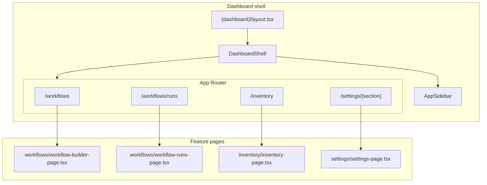

# Refactoring Plan — Frontend Aligned to CLAUDE.md (Option B)

> Based on: frontend structure analysis (2026-07-06) + `CLAUDE.md` frontend standards  
> Date: 2026-07-06  
> Status: **IMPLEMENTED** (2026-07-06)  
> Goal: Replace the single-route MVP workspace with proper Next.js App Router features, shared dashboard layout, and per-domain landing pages.

---

## Executive Summary

Today the application mounts **inventory**, **workflows**, and **settings** inside one client-side workspace (`WorkflowBuilderPage` + `useWorkspaceStore`). Only `/workflows` exists as a dashboard route; navigation is Zustand state, not URLs.

`CLAUDE.md` expects:

- One **route stub** per feature under `/app/(dashboard)/{feature}/page.tsx`
- One **landing page component** per feature under `/components/features/{domain}/{domain}-page.tsx` (or equivalent kebab-case name)
- A shared **`/components/layout/app-sidebar.tsx`** for navigation
- Feature logic isolated in feature folders — no cross-feature orchestration in a single “god” page

This plan migrates to **Option B**: full Next.js routing, a shared dashboard shell, and feature-owned pages. Scope is intentionally large; each phase is independently deployable where noted.

---

## Current vs Target

### Current (MVP workspace)

```
/  → redirect /workflows
/workflows  → WorkflowBuilderPage
                ├── WorkflowSidebar (global nav)
                ├── useWorkspaceStore → workflow | inventory | settings
                ├── InventoryPage (embedded)
                ├── SettingsTopbar + SettingsMockCanvas (embedded)
                └── Workflow canvas / executions (mode in Zustand)
```

### Target (CLAUDE.md-aligned)

```
/  → redirect /workflows

/dashboard layout (auth + DashboardShell)
├── AppSidebar (Link-based nav)
└── {children}  ← per-route feature page

/workflows           → WorkflowBuilderPage (editor only)
/workflows/runs      → WorkflowRunsPage
/inventory           → InventoryPage
/settings            → redirect /settings/general
/settings/[section]  → SettingsPage
```



---

## Route Map

| URL | Route stub | Feature page | Notes |
|-----|------------|--------------|-------|
| `/` | `app/page.tsx` | — | `redirect("/workflows")` (unchanged) |
| `/login` | `app/(auth)/login/page.tsx` | `auth/login-page.tsx` | Already correct |
| `/workflows` | `app/(dashboard)/workflows/page.tsx` | `workflows/workflow-builder-page.tsx` | Editor mode only |
| `/workflows/runs` | `app/(dashboard)/workflows/runs/page.tsx` | `workflows/workflow-runs-page.tsx` | **New** — executions panel |
| `/inventory` | `app/(dashboard)/inventory/page.tsx` | `inventory/inventory-page.tsx` | **New** route stub |
| `/settings` | `app/(dashboard)/settings/page.tsx` | — | `redirect("/settings/general")` |
| `/settings/[section]` | `app/(dashboard)/settings/[section]/page.tsx` | `settings/settings-page.tsx` | Section from URL param |

### Valid `[section]` values

Must match `SettingsSection` in `settings/types/settings-section.ts`:

`general` · `sources` · `credentials` · `users` · `hatchet` · `redis`

Invalid sections → `notFound()` in the route stub or page.

### Login success redirect

Verify only — no change needed. `auth/login-page.tsx` already does `router.replace("/workflows")` on success, which matches `app/page.tsx`'s default landing route. Re-confirm this still holds once routing changes land.

---

## Target Feature Folder Structure

### Shared layout (new)

```
frontend/src/components/layout/
├── app-sidebar.tsx          # Global nav (moved from WorkflowSidebar)
├── dashboard-shell.tsx      # Client wrapper: sidebar + main column
└── dashboard-header.tsx     # Optional: shared logout/user menu (see Phase 4)
```

### Workflows

```
frontend/src/components/features/workflows/
├── workflow-builder-page.tsx    # Editor only — slimmed down
├── workflow-runs-page.tsx       # NEW — wraps WorkflowExecutionsPanel + topbar
├── components/
│   ├── workflow-topbar.tsx
│   ├── workflow-canvas.tsx
│   ├── workflow-executions-panel.tsx
│   └── …                        # workflow-sidebar.tsx REMOVED (moved to layout)
├── dialogs/
├── hooks/
│   └── use-workflow-builder-store.ts   # `mode` field REMOVED
├── types/
└── utils/
```

### Inventory (unchanged layout, new route only)

```
frontend/src/components/features/inventory/
├── inventory-page.tsx
├── components/
├── dialogs/
├── hooks/
├── types/
└── utils/
```

### Settings

```
frontend/src/components/features/settings/
├── settings-page.tsx              # NEW — landing page entry point
├── components/
│   ├── settings-section-canvas.tsx  # RENAMED from settings-mock-canvas.tsx
│   ├── settings-topbar.tsx          # Uses URL / Link, not Zustand section
│   ├── sources-settings-canvas.tsx
│   ├── credentials-settings-canvas.tsx
│   ├── hatchet-settings-canvas.tsx
│   └── redis-settings-canvas.tsx
├── credentials/                   # Keep nested sub-domain as-is
├── constants/
│   └── settings-sections.ts
├── dialogs/
├── hooks/                         # use-workspace-store.ts REMOVED
├── types/
└── utils/
```

### Route stubs (all thin)

```tsx
// Example: app/(dashboard)/inventory/page.tsx
import { InventoryPage } from "@/components/features/inventory/inventory-page";

export default function InventoryRoute() {
  return <InventoryPage />;
}
```

No `'use client'`, no hooks, no business logic in route files, and no `components/` or `dialogs/` subdirectories inside route directories (per `CLAUDE.md` Route File Rule) — all of that lives under `components/features/{domain}/`.

---

## Implementation Order

Apply phases in sequence. Phases 1–3 deliver the structural migration; phases 4–6 polish and enforce standards.

| Phase | Focus | Deployable alone? |
|-------|--------|-------------------|
| **0** | Scaffolding + types | Yes |
| **1** | Dashboard shell + AppSidebar | Yes (parallel nav possible) |
| **2** | New routes + feature pages | Yes (core migration) |
| **3** | Remove workspace store + slim WorkflowBuilderPage | Yes (completes routing) |
| **4** | Cross-feature links + URL-driven settings tabs | Yes |
| **5** | Cleanup, renames, doc updates | Yes |
| **6** | Verification + tests | Yes |

---

## Phase 0 — Scaffolding

**Goal:** Add new files without breaking the existing MVP workspace.

### 0.1 Create layout components

**Create** `frontend/src/components/layout/dashboard-shell.tsx`:

- Client component (`"use client"`)
- Layout: `flex h-screen overflow-hidden` with `AppSidebar` + `children` in a `flex min-w-0 flex-1 flex-col` column
- Does **not** render feature topbars — each page owns its header

**Create** `frontend/src/components/layout/app-sidebar.tsx`:

- Start as a copy of `workflows/components/workflow-sidebar.tsx`
- Replace Zustand `openWorkflow` / `openInventory` / `openSettings` with `next/link` `Link` components
- Active state from `usePathname()`:
  - `/workflows` (exact, not `/workflows/runs`) → Workflows active
  - `/workflows/runs` → Runs active
  - `/inventory` → Inventory active
  - `/settings/*` → Settings active
- Remove “MVP workspace” footer copy or replace with product-neutral text

### 0.2 Create placeholder feature pages (optional staging)

**Create** stub pages that will replace embedded views later:

- `workflows/workflow-runs-page.tsx`
- `settings/settings-page.tsx`

They can initially re-export existing inner components so Phase 2 wiring is trivial.

### 0.3 Section route helper

**Create** `frontend/src/components/features/settings/utils/settings-section-params.ts`:

```ts
import type { SettingsSection } from "../types/settings-section";

const VALID_SECTIONS: SettingsSection[] = [
  "general", "sources", "credentials", "users", "hatchet", "redis",
];

export function parseSettingsSection(value: string): SettingsSection | null {
  return VALID_SECTIONS.includes(value as SettingsSection)
    ? (value as SettingsSection)
    : null;
}
```

---

## Phase 1 — Dashboard Layout Integration

**Goal:** Wrap all authenticated routes in the shared shell.

### 1.1 Update `(dashboard)/layout.tsx`

**File:** `frontend/src/app/(dashboard)/layout.tsx`

After auth checks, render:

```tsx
import { DashboardShell } from "@/components/layout/dashboard-shell";

// … auth unchanged …
return <DashboardShell>{children}</DashboardShell>;
```

`DashboardShell` is a client boundary; the server layout stays async and performs cookie/auth validation.

### 1.2 Temporarily dual-render sidebar (bridge step)

During migration, **either**:

- **A (recommended):** Remove `WorkflowSidebar` from `WorkflowBuilderPage` immediately once `DashboardShell` ships — single sidebar only.
- **B:** Feature-flag dual sidebar for one PR (not recommended; causes double nav).

### 1.3 Adjust `WorkflowBuilderPage` outer layout

Remove the outer `flex h-screen` + `<WorkflowSidebar />` wrapper. The page becomes content that fills the shell’s main column:

```tsx
// workflow-builder-page.tsx — target structure
return (
  <div className="flex min-h-0 flex-1 flex-col">
    <WorkflowTopbar … />
    <main className="flex min-h-0 flex-1">…editor only…</main>
    <WorkflowRunControls />
    {/* dialogs */}
  </div>
);
```

Full removal of inventory/settings branches happens in Phase 3.

---

## Phase 2 — New Routes and Feature Pages

**Goal:** Every major workspace area has its own URL and route stub.

### 2.1 Inventory route

**Create** `frontend/src/app/(dashboard)/inventory/page.tsx`:

```tsx
import { InventoryPage } from "@/components/features/inventory/inventory-page";

export default function InventoryRoute() {
  return <InventoryPage />;
}
```

`InventoryPage` already has its own in-page header — no extra topbar required unless design calls for one.

### 2.2 Settings routes

**Create** `frontend/src/app/(dashboard)/settings/page.tsx`:

```tsx
import { redirect } from "next/navigation";

export default function SettingsIndexRoute() {
  redirect("/settings/general");
}
```

**Create** `frontend/src/app/(dashboard)/settings/[section]/page.tsx`:

```tsx
import { notFound } from "next/navigation";
import { SettingsPage } from "@/components/features/settings/settings-page";
import { parseSettingsSection } from "@/components/features/settings/utils/settings-section-params";

type Props = { params: Promise<{ section: string }> };

export default async function SettingsSectionRoute({ params }: Props) {
  const { section } = await params;
  const parsed = parseSettingsSection(section);
  if (!parsed) notFound();
  return <SettingsPage section={parsed} />;
}
```

Optional: `export function generateStaticParams()` returning all section ids for static generation.

### 2.3 Settings landing page

**Create** `frontend/src/components/features/settings/settings-page.tsx`:

```tsx
"use client";

import { SettingsTopbar } from "./components/settings-topbar";
import { SettingsSectionCanvas } from "./components/settings-section-canvas";
import type { SettingsSection } from "./types/settings-section";

interface SettingsPageProps {
  section: SettingsSection;
}

export function SettingsPage({ section }: SettingsPageProps) {
  return (
    <div className="flex min-h-0 flex-1 flex-col">
      <SettingsTopbar activeSection={section} />
      <main className="min-h-0 flex-1">
        <SettingsSectionCanvas section={section} />
      </main>
    </div>
  );
}
```

### 2.4 Rename settings canvas dispatcher

**Rename** `settings-mock-canvas.tsx` → `settings-section-canvas.tsx`

- Export `SettingsSectionCanvas`
- Accept `section: SettingsSection` prop instead of reading `useWorkspaceStore`
- Keep internal dispatch to `SourcesSettingsCanvas`, `CredentialsSettingsCanvas`, etc.
- Keep placeholder UI for `general` and `users` until those sections are implemented

Update all imports (grep for `SettingsMockCanvas` and `settings-mock-canvas`).

### 2.5 Workflow runs route

**Create** `frontend/src/components/features/workflows/workflow-runs-page.tsx`:

- Renders `WorkflowTopbar` in a reduced configuration **or** a dedicated `WorkflowRunsTopbar` (workflow name + run controls only)
- Renders `WorkflowExecutionsPanel` as main content
- Uses `useWorkflowBuilderStore` for `workflowId` / `workflowName` context (shared with editor)

**Create** `frontend/src/app/(dashboard)/workflows/runs/page.tsx`:

```tsx
import { WorkflowRunsPage } from "@/components/features/workflows/workflow-runs-page";

export default function WorkflowRunsRoute() {
  return <WorkflowRunsPage />;
}
```

### 2.6 Workflows route stub

**Keep** `app/(dashboard)/workflows/page.tsx` — already a stub. After Phase 3 it only mounts the slimmed editor page.

---

## Phase 3 — Remove Workspace Store and Slim WorkflowBuilderPage

**Goal:** Delete client-side “app switching”; each route owns its view.

### 3.1 Delete workspace orchestration

**Remove from** `workflow-builder-page.tsx`:

- `useWorkspaceStore` import and usage
- `SettingsTopbar`, `SettingsMockCanvas` / `SettingsSectionCanvas` imports
- `InventoryPage` import
- Conditional branches on `workspace === "settings" | "inventory"`
- `WorkflowSidebar` import (already moved to layout in Phase 1)

**Delete** `frontend/src/components/features/settings/hooks/use-workspace-store.ts`

**Delete** `frontend/src/components/features/workflows/components/workflow-sidebar.tsx` (after `app-sidebar.tsx` is complete)

### 3.2 Remove `mode` from workflow builder store

**File:** `workflows/hooks/use-workflow-builder-store.ts`

- Remove `WorkflowMode` type and `mode` / `setMode` from state
- Remove `mode === "executions"` branches from `workflow-builder-page.tsx`
- Executions UI lives only on `/workflows/runs`

**Update callers** that used `setMode("executions")` after a run:

- Replace with `router.push("/workflows/runs")` (and optionally set `activeRunId` in store before navigate)

**Update** `workflow-sidebar.tsx` → `app-sidebar.tsx` (already Link-based from Phase 0):

- “Runs” → `href="/workflows/runs"`
- “Workflows” → `href="/workflows"`

### 3.3 Workflow builder page responsibilities (final)

`WorkflowBuilderPage` should only:

- Manage React Flow canvas state (nodes, edges)
- Workflow persistence (open, save, save as, manage)
- Run trigger (then navigate to runs page)
- Editor panels: properties, config modal, run controls footer
- Dialogs: save as, open, manage

Extract load/save/run handler blocks into hooks if the file remains >400 lines after slimming (see `ANALYSIS_FRONTEND_1.md` §4):

- `hooks/use-workflow-persistence.ts` (optional)
- `hooks/use-workflow-run-actions.ts` (optional)

---

## Phase 4 — Cross-Feature Navigation and Settings Tabs

**Goal:** Replace all `openSettings()` / `openInventory()` calls with router navigation.

### 4.1 Files that currently import `useWorkspaceStore`

| File | Current behaviour | Target |
|------|-------------------|--------|
| `inventory/components/nautobot-source-banner.tsx` | `openSettings("sources")` | `router.push("/settings/sources")` or `<Link href="/settings/sources">` |
| `workflow-steps/shared/nautobot-source-select-dialog.tsx` | `openSettingsSources("sources")` | `router.push("/settings/sources")` on CTA |
| `workflow-steps/get-git-devices/git-source-select-dialog.tsx` | same | same |
| `settings/components/settings-topbar.tsx` | `setSettingsSection` via Zustand | `Link` + `usePathname` or controlled tabs that call `router.push(`/settings/${id}`)` |

### 4.2 URL-driven settings topbar

**Refactor** `settings-topbar.tsx`:

- Props: `activeSection: SettingsSection`
- Each tab is a `Link` to `/settings/{id}` (or `router.push` on `Tabs` change)
- Keep logout button (or move to shared header — see 4.3)
- Remove `useWorkspaceStore` entirely

### 4.3 Consolidate logout (optional but recommended)

Today both `WorkflowTopbar` and `SettingsTopbar` duplicate logout. Options:

- **A:** Add user menu + logout to `AppSidebar` footer; remove from feature topbars
- **B:** Create `components/layout/dashboard-header-actions.tsx` shared by topbars

Pick one pattern and document it in `CLAUDE.md`.

### 4.4 Deep-link preservation for workflow runs

When navigating from editor to runs after starting a run:

```ts
router.push("/workflows/runs");
// activeRunId already set in useWorkflowBuilderStore before navigate
```

Optional enhancement: `/workflows/runs?runId=123` synced to store on mount for shareable run links (out of scope for minimum alignment; note as follow-up).

---

## Phase 5 — Cleanup, Renames, and Documentation

### 5.1 File moves and deletions checklist

| Action | Path |
|--------|------|
| **Create** | `components/layout/app-sidebar.tsx` |
| **Create** | `components/layout/dashboard-shell.tsx` |
| **Create** | `components/features/settings/settings-page.tsx` |
| **Create** | `components/features/workflows/workflow-runs-page.tsx` |
| **Create** | `app/(dashboard)/inventory/page.tsx` |
| **Create** | `app/(dashboard)/settings/page.tsx` |
| **Create** | `app/(dashboard)/settings/[section]/page.tsx` |
| **Create** | `app/(dashboard)/workflows/runs/page.tsx` |
| **Rename** | `settings-mock-canvas.tsx` → `settings-section-canvas.tsx` |
| **Delete** | `settings/hooks/use-workspace-store.ts` |
| **Delete** | `workflows/components/workflow-sidebar.tsx` |
| **Delete** | `Workspace` type export in `settings/types/settings-section.ts` (dead once `use-workspace-store.ts` is removed — verify with grep below before deleting) |

### 5.2 Grep verification (must be zero hits)

```bash
cd frontend
rg "useWorkspaceStore|use-workspace-store|SettingsMockCanvas|settings-mock-canvas|WorkflowSidebar" src/
rg 'workspace === "' src/
rg "\bWorkspace\b" src/components/features/settings/types/settings-section.ts
rg "openSettings|openInventory|openWorkflow" src/
```

### 5.3 Update `CLAUDE.md`

- Confirm `app-sidebar.tsx` path exists and matches “Adding New Frontend Page” steps
- Add note that `/workflows/runs` is the runs feature route (sub-route of workflows)
- Remove or update any MVP workspace language if present elsewhere
- Document settings URL pattern: `/settings/[section]`

### 5.4 Update `README.md` (if it describes single-page workspace)

Point developers to the four dashboard routes and the layout shell.

---

## Phase 6 — Verification and Tests

### 6.1 Manual acceptance checklist

- [ ] `/` redirects to `/workflows`
- [ ] Unauthenticated access to any dashboard route redirects to `/login`
- [ ] Sidebar highlights correct item for each route
- [ ] `/workflows` shows editor only (canvas, properties panel, run controls)
- [ ] `/workflows/runs` shows executions panel
- [ ] `/inventory` shows inventory builder (full page, not embedded)
- [ ] `/settings` redirects to `/settings/general`
- [ ] Each `/settings/{section}` tab works and survives browser refresh
- [ ] Invalid `/settings/foo` returns 404
- [ ] “Configure sources” from inventory banner navigates to `/settings/sources`
- [ ] Nautobot/git source dialogs navigate to `/settings/sources`
- [ ] Starting a workflow run navigates to `/workflows/runs`
- [ ] Login lands on `/workflows`
- [ ] No duplicate sidebars
- [ ] Route files contain no `'use client'` and no hooks
- [ ] No route directory contains a `components/` or `dialogs/` subdirectory
- [ ] `Workspace` type removed from `settings/types/settings-section.ts` once `use-workspace-store.ts` is deleted

### 6.2 Automated tests (recommended alongside migration)

| Test | Type | File (suggested) |
|------|------|------------------|
| `parseSettingsSection` valid/invalid | Unit | `settings/utils/settings-section-params.test.ts` |
| Route stubs re-export correct pages | Smoke | Playwright or Vitest + next/router mock |
| Sidebar active state per pathname | Component | `app-sidebar.test.tsx` |
| Settings tab links hrefs | Component | `settings-topbar.test.tsx` |

Aligns with `ANALYSIS_FRONTEND_1.md` priority #1 (test infrastructure).

### 6.3 Lint and build

```bash
cd frontend
npm run lint
npm run build
```

Fix any broken imports from renames before merging.

---

## Store and State Ownership (Post-Migration)

| State | Owner | Scope |
|-------|--------|-------|
| Auth user | `lib/auth-store.ts` | Global |
| Workflow canvas + metadata | `use-workflow-builder-store.ts` | Workflows feature; shared between `/workflows` and `/workflows/runs` |
| Settings section | **URL** (`/settings/[section]`) | Settings feature — no Zustand |
| Active app / workspace | **Removed** — routing replaces it | — |
| Inventory UI | Local component state + query hooks | Inventory feature |

---

## Risks and Mitigations

| Risk | Mitigation |
|------|------------|
| Losing workspace context on refresh | URL carries settings section; workflow store rehydrates from last loaded workflow (existing behaviour) |
| Double sidebar during migration | Complete Phase 1 sidebar removal in same PR as shell introduction |
| Broken deep links to `/workflows` only | Acceptable; no external `/inventory` links existed before |
| `WorkflowExecutionsPanel` depends on editor store | Keep shared `useWorkflowBuilderStore`; document that runs page requires a workflow to be loaded |
| Large `workflow-builder-page.tsx` diff | Phase 3 deletion of branches is mostly subtractive; extract hooks in a follow-up PR if needed |

---

## Follow-Up Work (Not Blocking Alignment)

These items from `ANALYSIS_FRONTEND_1.md` complement this refactor but are separate tasks:

1. Replace raw `fetch()` in `workflow-builder-page.tsx` with `useWorkflowQuery` detail hook
2. Fix `workflowUuid` omitted in `loadWorkflow` store setter
3. Extract inline `useQuery` calls to dedicated hooks under `hooks/queries/`
4. Split `step-result-viewer.tsx` (>800 lines)
5. Replace arbitrary Tailwind colors with semantic tokens
6. Add `?runId=` query param support on `/workflows/runs`
7. Implement real `general` and `users` settings sections (replace placeholders in `SettingsSectionCanvas`)

---

## PR Slicing Suggestion

For reviewability, land as **3 PRs**:

1. **PR 1 — Layout shell:** `DashboardShell`, `AppSidebar`, update `(dashboard)/layout.tsx`, remove sidebar from `WorkflowBuilderPage` (workspace switching still works temporarily via store)
2. **PR 2 — Routes + new pages:** All route stubs, `SettingsPage`, `WorkflowRunsPage`, rename canvas, URL-driven settings topbar; still keep workspace fallbacks behind a flag if needed
3. **PR 3 — Delete workspace store:** Remove all `useWorkspaceStore` usage, delete files, update cross-feature links, grep clean, docs

Alternatively, one large PR if the team prefers atomic migration.

---

## Definition of Done

The frontend is **aligned with CLAUDE.md** when:

1. Every dashboard feature has a route stub under `app/(dashboard)/`
2. Every feature has a dedicated page component in `components/features/{domain}/`
3. `components/layout/app-sidebar.tsx` exists and is the sole navigation sidebar
4. `useWorkspaceStore` and `WorkflowSidebar` are deleted
5. `WorkflowBuilderPage` does not import or render inventory or settings UI
6. Settings section selection is URL-driven (`/settings/[section]`)
7. Route files are pure stubs (no `'use client'`, no business logic)
8. `CLAUDE.md` “Adding New Frontend Page” steps match the implemented structure
